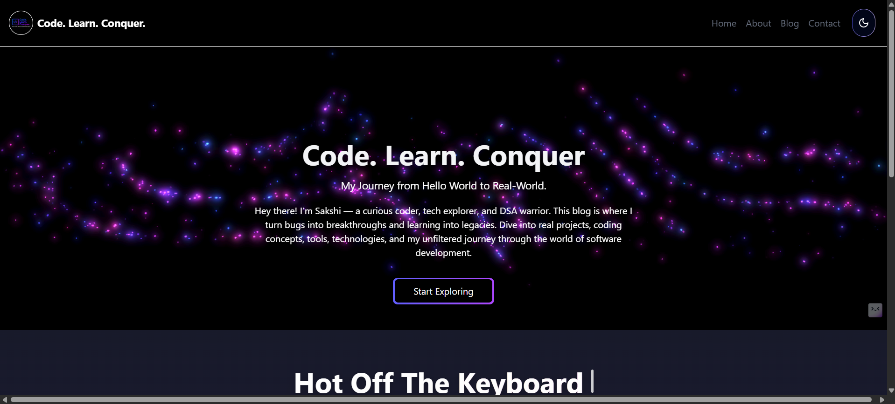
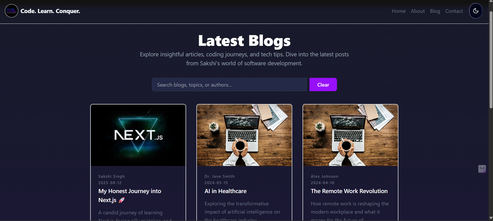
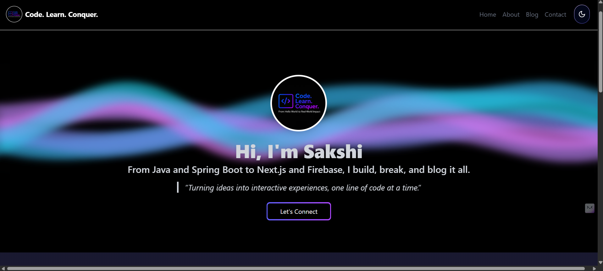
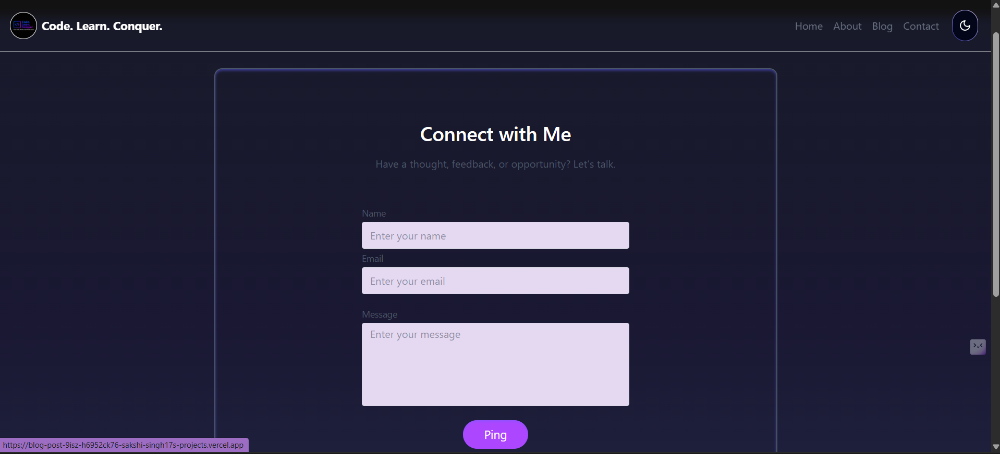

# 🧠 Code. Conquer. Learn.

A personal blog website built with **Next.js**, **Tailwind CSS**, **ShadCN UI**, and **Acertainty UI** where I document my journey through **Data Structures & Algorithms**, **debugging**, **tech learnings**, and **project-building experiences**.

This is not a tutorial site — it’s a **developer diary** where I write about what I learned, how I debugged, and how I grew.

---

## ✨ Features

- 🚀 Built with Next.js 14 App Router
- 🎨 Styled using Tailwind CSS
- 🧩 Modular components using ShadCN UI & Acertainty UI
- ✍️ Write blog posts in Markdown
- 📌 Pages for Blog, About Me, and Contact
- 🧠 Focused on sharing real-life debugging stories and coding experiences

---

## 📁 Folder Structure

```

.
├── app
│   ├── about
│   ├── blog
│   ├── contact
│   ├── favicon.ico
│   ├── globals.css
│   ├── layout.js
│   └── page.js
├── components
├── lib
├── public
├── .gitignore
├── README.md
├── components.json
├── eslint.config.mjs
├── jsconfig.json
└── next.config.mjs

```

---

## 🖼️ Screenshots

### 💻 Home Page


### 📝 Blog Page


### 📝 Blog Preview


### 📝 About Page


### 📝 Contact Page


---

## 🛠️ Technologies Used

| Tech            | Purpose                                |
|-----------------|----------------------------------------|
| Next.js         | React Framework                        |
| Tailwind CSS    | Utility-first CSS styling              |
| ShadCN UI       | Accessible UI components               |
| Acertainty UI   | UI aesthetics                          |
| Markdown        | Blog content format                    |
| Vercel (optional) | Deployment                           |

---

## 🚧 Future Enhancements

- [ ] Add Tags/Filters for Blog Categories
- [ ] Comment Section using GitHub Discussions or giscus

---

## 🤝 Contribution

This is a personal project. But feel free to fork, explore, and use ideas for your own learning blog!

---

## 📬 Contact

If you find this useful or want to connect:

- 🌐 [My LinkedIn](https://www.linkedin.com/in/sakshi-amit-singh/)
- 📧 Email: sakshi.singh171101@gmail.com 

---

## 🪄 Inspiration

Built as a way to stay consistent with my learning and to conquer one bug at a time 💪  
**Code. Conquer. Learn.**

---

```

---

### ✅ To Use This:

1. Copy the content into your `README.md`
2. Add screenshots into a `screenshots/` folder inside the root directory
3. Replace the links and email with your actual info
4. Commit & push!

Would you like me to generate the markdown file and upload it for you as well?
